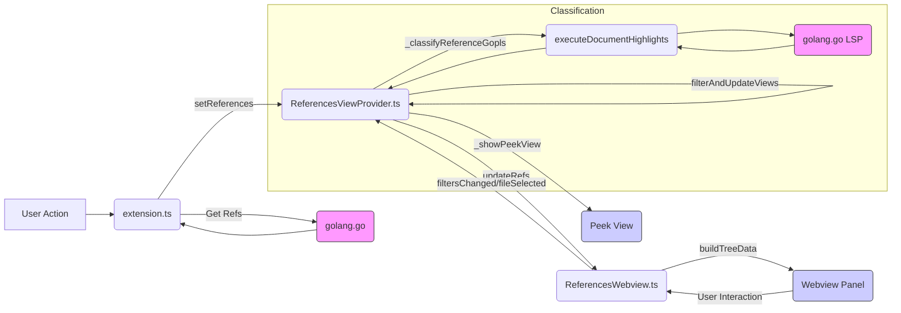

# System Patterns: go-extras VS Code Extension

## Architecture Overview
The extension consists of three main components:

1. **Extension Host (`src/extension.ts`)**:
   - Handles command registration (`go-extras.filterReferences`)
   - Fetches references via `golang.go` extension (`executeReferenceProvider`)
   - Coordinates with the View Provider

2. **Webview View Provider (`src/ReferencesViewProvider.ts`)**:
   - Manages webview lifecycle
   - Generates HTML with injected resources
   - Handles state (references, filters)
   - Bridges communication with webview
   - Performs LSP-based classification (`_classifyReferenceGopls`)
   - Filters references based on UI state
   - Controls Peek View (`editor.action.showReferences`)

3. **Webview UI (`src/ReferencesWebview.ts` + `webview-ui/references.html`)**:
   - Renders filter controls (`vscode-checkbox-group`)
   - Displays reference tree (`vscode-tree`)
   - Communicates with provider via `acquireVsCodeApi`
   - Builds tree data structure (`buildTreeData`)

## Communication Flow

## Key Patterns
1. **Lazy Classification**: References are classified on-demand using LSP
2. **CSP-Secure Webview**: HTML uses strict CSP with nonce for scripts
3. **View Provider Pattern**: Dedicated class manages webview lifecycle
4. **Message-Based Communication**: Webview and extension communicate via `postMessage`